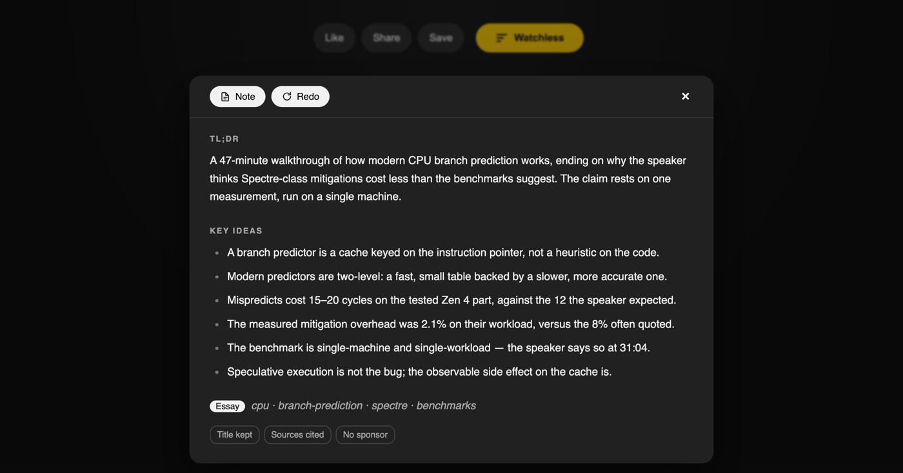
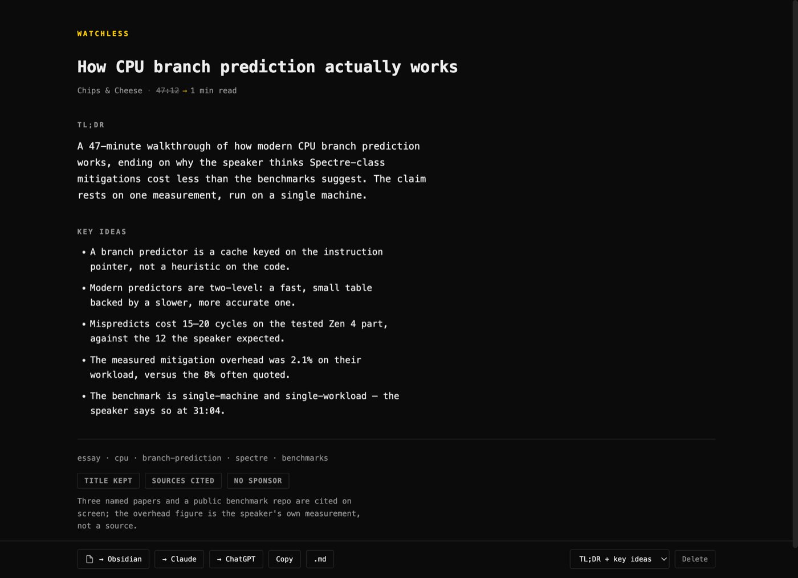
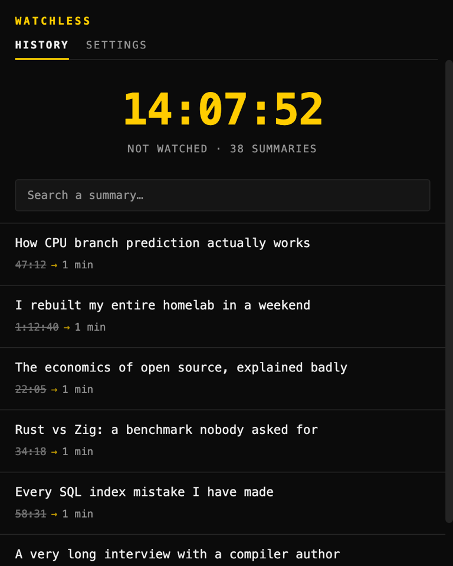
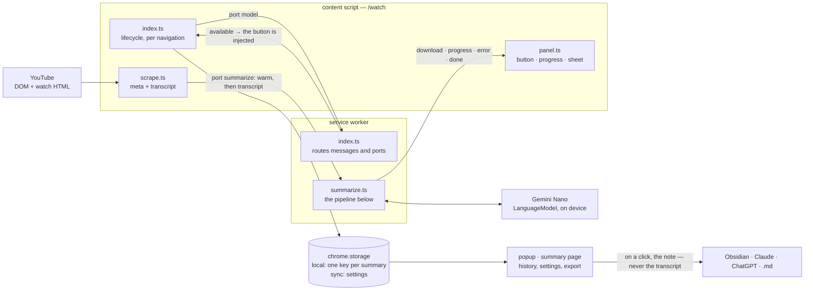
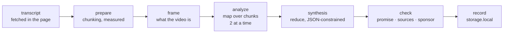

<div align="center">


# Watchless

**Watch less, know more.**

A Chrome extension that summarizes a YouTube video **on your machine** — Gemini
Nano, the built-in Prompt API — and exports a markdown note to Obsidian.
No API key, no account, no server. Nothing leaves the machine without a click.

[](LICENSE)
[](#requirements)
[](#requirements)
[](package.json)



</div>

---

## What it does

You open a 47-minute video. You press one button. A minute later you have a
TL;DR, the key ideas, the tags, and a row of checks on what the video is worth —
in a note you own, in a vault you control.

- **On-device.** Gemini Nano runs in Chrome. The transcript is read on
  youtube.com, the page you are already on. There is no outbound request.
- **Free, forever, by construction.** No key to buy, no quota to hit — the cost
  of a summary is your own GPU.
- **A note, not a chat.** `→ Obsidian` writes `Youtube/<Title>.md`, frontmatter
  included. `→ Claude` and `→ ChatGPT` hand that note to a big model for a
  follow-up: the small local model sorts, the big one digs on demand. It is the
  note that leaves, not the transcript.
- **Format-aware.** The model infers what the video *is* — comedy, tutorial,
  essay, interview, news, vlog — before summarizing it. That is what keeps a
  sketch from being summarized like a report.

## Install

```bash
npm install && npm run build     # builds into dist/
```

Then `chrome://extensions` → developer mode → **Load unpacked** → the `dist/`
folder.

Open the toolbar icon → **Settings**: summary shape, Obsidian vault name, target
folder, summary language (*automatic* = Chrome's language). The model (several
GB) does **not** download on its own — start it from that same tab.

## Requirements

The model runs on the machine: without the hardware, there is no summary. The
floor is Chrome's, not ours.

| | |
|---|---|
| **Chrome** | 138+ desktop — Windows 10/11, macOS 13+, Linux, ChromeOS. Neither Android nor iOS. |
| **Disk** | > 22 GB free on the Chrome profile volume (the model is deleted if free space drops back under 10 GB) |
| **GPU** | > 4 GB of VRAM |
| **Network** | not metered — Chrome refuses to download over a metered connection |
| **Obsidian** | optional; the vault name is set in the extension settings |

Above that floor, Watchless recommends **8 GB of RAM and 4 cores**: a summary is
a five-pass map-reduce, and below that it runs slowly enough to stop saving any
time. That is the only part the extension can measure, and the only warning it
displays.

Below the recommendations, Watchless disables itself and says so in the Settings
tab, with the number behind it. *Enable anyway* lifts the block. When it is
Chrome that refuses, there is nothing to enable — `create()` fails — and the
extension shows the requirements rather than a button that would lie.

## Usage

On a YouTube video page: the **Watchless** button appears under the player. The
video keeps playing while the button shows the progress; once ready, the summary
takes the player's place.

The button only appears once the model is available. As long as it is missing —
not downloaded yet, or machine below the recommendations — the YouTube page
stays untouched and everything happens in the popup. Once the download is done,
the button appears in the already-open tabs, without reloading them.

## Summary shape

The format is detected; the **shape** is chosen in the settings. The format says
what the video *is*, the shape says what to pull out of it:

| Shape | What the note contains |
|---|---|
| **TL;DR + key ideas** | the default: what the video is about, 8 to 20 ideas |
| **Is it worth watching?** | a verdict — watch, skim, skip — and what it rests on |
| **What to do** | the steps, tools and settings, with their exact values |
| **Quotes** | the sentences from the video, word for word, in the spoken language |
| **Figures & sources** | every figure, date, study or name cited, and what it proves |

On the page of a summary already made, the selector at the bottom replays the
video under another shape and replaces the summary. It refetches the transcript:
YouTube sometimes refuses outside of its own tab, in which case the redo has to
happen from the video page.

## Checks

Under the summary, a row of pills says what the video is worth: whether the title
keeps its promise, whether the claims are sourced or point to an anonymous
authority (*"studies show"*), and who pays — the sponsor named in the video, or
the *paid promotion* disclosure declared by YouTube. When nothing catches, the
pill says that too. All of it lands in the note frontmatter (`promise:`,
`sources:`, `sponsor:`, `paid:`).

These are checks, not verdicts: apart from YouTube's disclosure, they come from
the same small local model as the summary. The rationale is therefore always
shown with the check, so that a judgment on someone else's work can be refuted at
a glance. Nothing is sent or shared — there is no community database, and there
will not be one: claims about real people, voted on and hosted, are not a
technical problem.

Sourcing is not assessed on sketches or vlogs: what claims nothing has nothing to
source.

<div align="center">

</div>

## History

Every summary is kept locally. Coming back to an already-summarized video shows
*See the summary* right away, without going through Nano again.

The toolbar icon opens the history: the time that was **not** spent watching
(video length minus the summary's reading time, at 200 words/minute), and the
list of summaries with search. A `×` on row hover deletes it. The last 500 are
kept, the oldest drop off.

Clicking a row opens the summary's **page** in a new tab: the full summary in a
readable column, plus the Obsidian export, copy, `.md` download and delete. A
twenty-idea summary has no place in a toolbar popup.

The time shown is not the length of the videos: reading the summary costs
something, and that cost is deducted. A summary reads in about a minute.

<div align="center">

</div>

## Architecture

Three contexts, one port per run. Nothing crosses the machine boundary: the
transcript is read on the page you are already on, the model runs in Chrome, the
record stays in `chrome.storage`.



The `warm` message carries the language, the shape and the video meta *before*
the transcript exists: the Nano session loads while the fetch runs. A disconnect
before `done` means the worker was killed, not a normal end.

Each phase runs on a `session.clone()` — clean context, system prompt kept. Chunk
size is measured against the model's real quota, not estimated.



The percentages of the progress gauge are the weights of these phases, in
`lib/perf.ts`.

## Development

```bash
npm run build      # esbuild -> dist/ (minified)
npm run watch      # esbuild in watch mode, reload the extension by hand
npm run typecheck  # tsc --noEmit (esbuild does not type-check)
npm test           # node --test, pure logic in src/lib/
npm run check      # Biome (lint + format + import org.) + typecheck
npm run knip       # dead code / unused exports
```

```
src/content/     the YouTube page — index.ts orchestrates, scrape.ts reads the
                 DOM/HTML, panel.ts writes the UI, state.ts holds the session
src/background/  the worker — index.ts routes the messages, summarize.ts drives
                 the Nano sessions
src/popup/       the toolbar page (history + settings)
src/summary/     the full-page summary sheet
src/lib/         pure logic, tested under Node, no chrome.* dependency
src/lib/types.ts the domain shapes: Rec, Meta, Summary, Checks…
```

Everything is strict TypeScript, bundled by `build.mjs` (~40 lines of esbuild)
into `dist/`, which mirrors the `src/` tree — `manifest.json` and the HTML pages'
relative paths are therefore untouched. The content script comes out as IIFE:
that is the build's reason to exist, an MV3 content script being a classic script
that cannot `import`. The tests run directly on the `.ts` (Node strips the types
natively), hence `node --test` with no extra dependency.

The tests also cover i18n consistency: every key used in the code exists in
`_locales`, and no key lingers there unused.

Biome note: `useHeadingContent` and `noLabelWithoutControl` are disabled — the
HTML labels are injected at runtime by `data-i18n`, the source is deliberately
empty.

## Contributing

Issues and pull requests are welcome — [CONTRIBUTING.md](CONTRIBUTING.md) has the
setup, the loop, and the four constraints that a PR most often trips on (i18n
keys, erasable-only TypeScript, `src/lib/` free of `chrome.*`, and the content
state resetting on navigation). Participation is under the
[Code of Conduct](CODE_OF_CONDUCT.md); vulnerabilities go through
[SECURITY.md](SECURITY.md), not a public issue.

<div align="center">

MIT licensed · built for people with a watch-later list they will never watch

</div>
